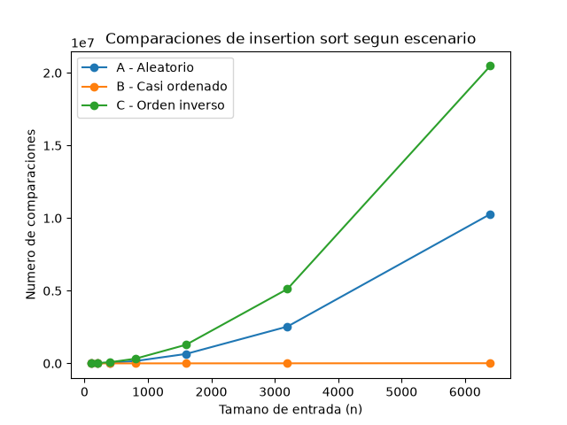
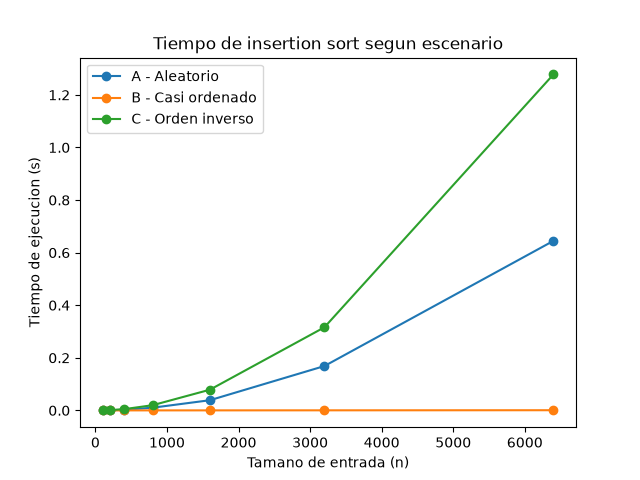

# Laboratorio evaluativo 01 — Fundamentos, complejidad y recurrencias

**David Zuluaga Ceballos**

## Parte 1 — Analizar el algoritmo antes de comprar hardware

Hay que encontrar primero que todo la causa raiz, si sabemos que el algoritmo esta diseñado con cierto patrón, que es un poco mas desactualizado y no cumple con lo requerido, insertion sort no es eficiente en tiempo de ejecución para 1'200.000 registros. Con lo que dices podemos deducir que Tamiza cumple su objetivo de ordenar correctamente pero incumple el rango de tiempo, que algo funcione correctamente no quiere decir que sea lo mas productivo.

Duplicar la velocidad del servidor puede resolver hasta cierta parte, pero insertion sort tiene una ecuacion cuadratica, lo que nos indica que si el numero de registros se duplica, los recursos necesarios no van a ser solo el doble tambien, si no que sera cuadriplicado. Un servidor que sea mas rapido solo mejora un poco comparado con lo anterior, pero un buen algoritmo le gana a un mejor servidor. Esto sin contar que es mucho mas alto el costo de, cada vez que incremente los registros, aumentar la capacidad del servidor, comparado con la inversion del algortimo que seria unica.

El siaweb del itm hace 1 o 2 años, en las asesorias de matricula para elegir materias de los estudiantes, siempre generaba una sesion demasiado lenta por el alto volumen de estudiantes: eran 26mil en la sesion al mismo tiempo. Esto hacia que muchos estudiantes perdieramos el cupo en materias o grupos que necesitabamos por la alta demora en las peticiones. Lo que yo experimenté en el software fue una mejora muy grande, ya que en el momento es muchisimo mejor y no causa problema al momento de hacer la asesoria, y ese numero en la sesion ha incrementado a aproximadamente 30mil.


## Parte 2 — Responsabilidad ambiental y ética de la implementación

Analizando un poco mas la situacion y adentrandonos en temas un poco mas algidos: ¿que pasa en el tema ambiental con un servidor encenndido mas tiempo durante muchos años? El gasto energetico que se genera se va llendo en una cadena, porque por ejemplo en nuestro pais la mayor productora de energia es el agua, basado en las hidroelectricas, entonces ademas del gasto energetico se le suma el desgaste hidrico.

Ademas, como el algoritmo es ineficiente en tiempos, tambien puede generar mas daños basados en su mal procesamiento, ya que si hay mejores algortimos, mejores alternativas, lo pasado va quedando obsoleto. Es muy probable que como el algoritmo no termine a tiempo, no queden bien ordenados los pacientes y que dejen a uno de riesgo alto para el final, o que ni siquiera quede en la lista prioritaria. El costo en ese escenario lo asume el paciente con su salud o hasta con su vida, y ustedes como institucion lo asumen en su reputación y hasta en cargos legales. Estos son de los peores escenarios, pero pueden existir.

No solo se convierte en perjuicio, como lo indique antes, para los pacientes, si no tambien para los operadores del centro: trabajan con una lista incompleta y eso los pone en una posicion de decidir sin herramientas, y eso se les puede culpar a ellos por algo que no depende de su trabajo. Vamos viendo como una sola decision repercute en tantos ambitos y en tantas personas sin culpa alguna.

Desde una vista de profesionales se debe tener una responsabilidad etica y moral: productos realizados con excelente calidad desde un principio, cubriendo todos los posibles escenarios. No basta solo con que termine a tiempo, si no que no hayan errores silenciosos, que se genere un trabajo limpio, correcto y puntual. En este ambito no se corren los mismos riesgos que en un error de facturacion o algo similar, que solo es un problema de dinero; aqui estamos hablando de daños irreparables en la salud o hasta perder una vida.


## Parte 3 — Peor caso, mejor caso y caso promedio, demostrados en Python

### 3.1 — Explicación

Teniendo un pensamiento mas critico de los posibles escenarios que son posibles que lleguen a ocurrir dependiendo del canal de origen de los datos para ese dia, para todos los casos tendremos un numero n definido que sea por ejemplo el 5 entonces, el escenario A es el que llega directamente como reciben los datos, es decir de una forma aleatoria, esto es demasiada carga para el servidor, porque debe comparar dato por dato, en un rango muy amplio, cada dato o registro es comparado con todos los menores hasta encontrar su lugar de origen, puede que en algunas partes se encuentren datos muy seguidos entonces eso es bueno pero no en todos se asegura, por todo lo anterior explicado en terminos de tiempo y efectividad este seria el caso promedio y tomando como referencia el n que dimos anteriormente es posible que vengan en el orden menos conveniente para ordenar los datos completamente toque hacer las maximas iteraciones que en ese caso serian 5, ahora abordamos el escenario B que a mi parecer viene siendo el mejor caso debido a que ya tenemos el 98% de los registros ordenados por riesgo, sigue existiendo un 2% sin ordenar que se va automaticmante al final, pero se corre un menor riesgo ya que la mayor parte del trabajo se ha realizado, teniendo en cuenta el n anterior los datos quedan ordenados el principio como se requiere, y al final quedan los quue no se alcanzaron a evaluar, pero seria un riesgo mas minimo comparado con todos los demas, y el ultimo escenario el C es el peor caso ya que los datos vienen ordenados pero ascendentemente, este es el que mas recursos consumiria al momento de reorganizar, porque el ultimo sera el primero y el primero sera el último, hay que invertir el orden completamente, es decir el que mas tiempo gastaria, y nuevamente haciendo un analisis con el n = 5 este si o si obligaria a hacer el maximo de iteraciones posibles, en este caso 5, en general el gran problema aqui es que hay 3 metodos diferentes de obtencion de los datos y tenemos solo un rango de 4 horas, depende del metodo que haya llegado un dia va a corresponder la vida de las personas que esten en los registros de ese dia muy bien donde todos los dias llegara el mejor caso, pero eso no es asegurable esto se convierte en otro problema aun mayor.

Precisamente por esto, para decidir si el algoritmo entra en producción usaria el peor caso, porque es el unico que da una garantia real, si el sistema se diseña pensando en que siempre va a llegar el escenario mas favorable (B) y un dia llega el escenario C, el proceso no alcanzaria a caber en las 4 horas, y eso pondria en riesgo directamente a los pacientes. El peor caso asegura que, pase lo que pase con el canal de origen ese dia, el sistema sigue funcionando dentro del limite.

### 3.2 — Demostración experimental

[código de la Parte 3](parte3_casos.py) — usa las funciones de [algoritmos.py](algoritmos.py) y [datos.py](datos.py).




Teniendo las graficas ya creadas, podemos comparar con nuestro analisis anteriormente hecho. Nos podemos dar cuenta que efectivamente el caso C de orden inverso era el peor escenario, el B que es el casi ordenado es el mejor escenario, el mas estable sin importar el n, y que el caso promedio era el de orden aleatorio.

Como vemos en las graficas, hay cierta similitud o apego entre los 3 escenarios hasta antes del tamaño de entrada 1000, aproximadamente en 800. De ahi en adelante, con n mas altos, es que se empieza a ver la diferencia entre los escenarios y la volatilidad que presenta uno comparado con otro.

Tenia sentido mi argumentacion de la parte 3.1, debido a que insertion sort tiene una forma de comparacion hacia atras, esto nos quiere decir que el orden inverso lo obliga a hacer el mayor numero de iteraciones.


## Parte 4 — Complejidad de merge sort e insertion sort: cálculo y validación

### 4.1 — Cálculo teórico

### Recurrencia de merge sort

Merge sort divide el arreglo en dos mitades, ordena cada mitad por separado (recursivamente) y luego las combina en una sola lista ordenada. Esto se plantea con la recurrencia:

T(n) = 2T(n/2) + Θ(n)

- El **2** indica que en cada llamada el problema se divide en 2 subproblemas (las dos mitades del arreglo).
- El **n/2** indica que cada uno de esos subproblemas tiene la mitad del tamaño del arreglo original.
- El **Θ(n)** es el costo de la mezcla: para combinar las dos mitades ya ordenadas en una sola lista ordenada, hay que recorrer los n elementos una vez.

### Resolución por Método Maestro

La forma general del método maestro es T(n) = aT(n/b) + f(n). Identificamos:

- a = 2 (2 subproblemas)
- b = 2 (cada subproblema es la mitad del tamaño)
- f(n) = Θ(n) (costo de la mezcla)

Calculamos n^(log_b a):

log_b a = log₂ 2 = 1
n^(log_b a) = n^1 = n

Comparamos f(n) contra n^(log_b a):

f(n) = Θ(n) es igual a n^(log_b a) = n

Esto corresponde al **Caso 2** del método maestro: cuando f(n) = Θ(n^(log_b a)), la solución es:

T(n) = Θ(n^(log_b a) · log n)

Como n^(log_b a) = n, entonces:

**T(n) = Θ(n log n)**

### Costo de insertion sort (analisis linea por linea)

Basado en la implementacion de `insertion_sort` en [algoritmos.py](algoritmos.py):

```python
for i in range(1, len(lista)):        # se ejecuta (n-1) veces
    actual = lista[i]                  # se ejecuta (n-1) veces
    j = i - 1                          # se ejecuta (n-1) veces
    while j >= 0:                      # en el peor caso, se ejecuta i veces
        comparaciones += 1             # se ejecuta i veces (peor caso)
        if lista[j] < actual:          # se ejecuta i veces (peor caso)
            lista[j + 1] = lista[j]    # se ejecuta i veces (peor caso)
            j -= 1                     # se ejecuta i veces (peor caso)
        else:
            break
    lista[j + 1] = actual              # se ejecuta (n-1) veces
```

En el peor caso (escenario C, orden inverso), cada elemento en la posicion i tiene que compararse con los i elementos anteriores antes de encontrar su lugar. Sumando el trabajo del bucle interno para cada i desde 1 hasta n-1:

1 + 2 + 3 + ... + (n-1) = (n-1) * n / 2

Esto es una suma que crece proporcional a n², asi que el costo total del algoritmo en el peor caso es:

**O(n²)**

En el mejor caso (escenario B, casi ordenado), el bucle interno `while` se ejecuta una sola vez por cada elemento (una sola comparacion, y como ya esta en orden, hace `break` de inmediato). Esto da un costo de:

**O(n)**

### Tabla de complejidades

| Algoritmo | Mejor caso | Peor caso | Caso promedio |
|---|---|---|---|
| Insertion sort | O(n) | O(n²) | O(n²) |
| Merge sort | O(n log n) | O(n log n) | O(n log n) |