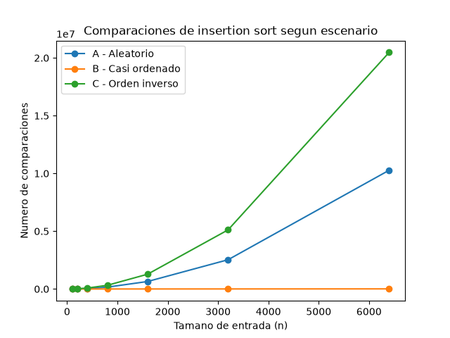
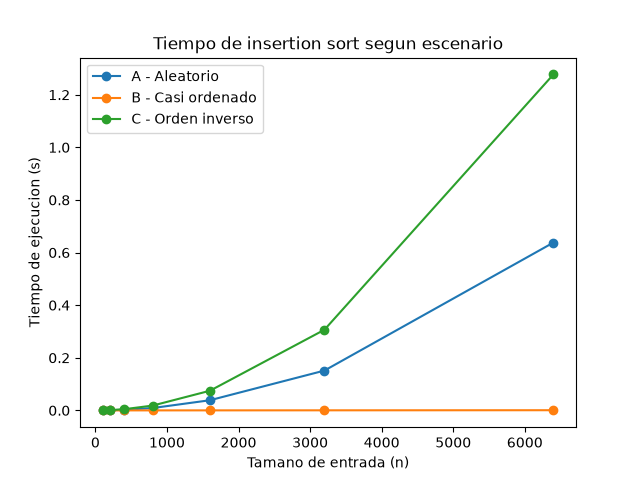
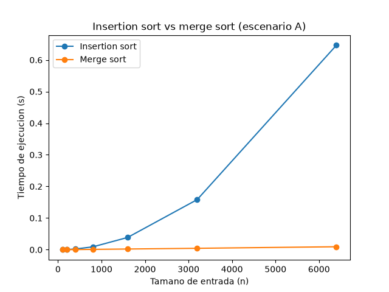

# Laboratorio evaluativo 01 — Fundamentos, complejidad y recurrencias

**David Zuluaga Ceballos**

## Instrucciones para reproducir el experimento

1. Active el entorno virtual desde la raíz del repositorio:
```bash
   source venv/bin/activate
```
2. Instale las dependencias:
```bash
   pip install -r requirements.txt
```
3. Para generar las gráficas de la Parte 3:
```bash
   cd lab1-fundamentos-complejidad-recurrencias
   python parte3_casos.py
```
4. Para generar la gráfica de la Parte 4:
```bash
   python parte4_complejidad.py
```


## Parte 1 — Analizar el algoritmo antes de comprar hardware

Hay que encontrar primero que todo la causa raiz, si sabemos que el algoritmo esta diseñado con cierto patrón, que es un poco mas desactualizado y no cumple con lo requerido, insertion sort no es eficiente en tiempo de ejecución para 1'200.000 registros. Con lo que dices podemos deducir que Tamiza cumple su objetivo de ordenar correctamente pero incumple la restriccion de la ventana de cuatro horas (entre las 2:00 a.m y las 6:00 a.m) que no es negociable, que algo funcione correctamente no quiere decir que sea lo mas productivo.

Duplicar la velocidad del servidor puede resolver hasta cierta parte, pero insertion sort tiene una ecuacion cuadratica, lo que nos indica que si el numero de registros se duplica, los recursos necesarios no van a ser solo el doble tambien, si no que sera cuadriplicado. Un servidor que sea mas rapido solo mejora un poco comparado con lo anterior, pero un buen algoritmo le gana a un mejor servidor. Esto sin contar que es mucho mas alto el costo de, cada vez que incremente los registros, aumentar la capacidad del servidor, comparado con la inversion del algortimo que seria unica.

Un ejemplo propio es el siaweb del itm hace 1 o 2 años, en las asesorias de matricula para elegir materias de los estudiantes, siempre generaba una sesion demasiado lenta por el alto volumen de estudiantes: eran 26mil en la sesion al mismo tiempo. Esto hacia que muchos estudiantes perdieramos el cupo en materias o grupos que necesitabamos por la alta demora en las peticiones. Desconozco qué algoritmo concreto usaba el sistema (por eso no afirmo que fuera insertion sort), pero muestra el mismo patrón: algo que funcionaba con poca carga y falló al crecer. Lo que yo experimenté en el software fue una mejora muy grande, ya que en el momento es muchisimo mejor y no causa problema al momento de hacer la asesoria, y ese numero en la sesion ha incrementado a aproximadamente 30mil sin presentar estos problemas.


## Parte 2 — Responsabilidad ambiental y ética de la implementación

Analizando un poco mas la situacion y adentrandonos en temas un poco mas algidos: ¿que pasa en el tema ambiental con un servidor encenndido mas tiempo durante muchos años? El gasto energetico que se genera se va llendo en una cadena, porque por ejemplo en nuestro pais la mayor productora de energia es el agua, basado en las hidroelectricas, entonces ademas del gasto energetico se le suma el desgaste hidrico.

Ademas, como el algoritmo es ineficiente en tiempos, tambien puede generar mas daños basados en su mal procesamiento, ya que si hay mejores algortimos, mejores alternativas, lo pasado va quedando obsoleto. Es muy probable que como el algoritmo no termine a tiempo, no queden bien ordenados los pacientes y que dejen a uno de riesgo alto para el final, o que ni siquiera quede en la lista prioritaria. El costo en ese escenario lo asume el paciente con su salud o hasta con su vida, y ustedes como institucion lo asumen en su reputación y hasta en cargos legales. Estos son de los peores escenarios, pero pueden existir.

No solo se convierte en perjuicio, como lo indique antes, para los pacientes, si no tambien para los operadores del centro: trabajan con una lista incompleta y eso los pone en una posicion de decidir sin herramientas, y eso se les puede culpar a ellos por algo que no depende de su trabajo. Vamos viendo como una sola decision repercute en tantos ambitos y en tantas personas sin culpa alguna.

Desde una vista de profesionales se debe tener una responsabilidad etica y moral: productos realizados con excelente calidad desde un principio, cubriendo todos los posibles escenarios. No basta solo con que termine a tiempo, si no que no hayan errores silenciosos, que se genere un trabajo limpio, correcto y puntual. En este ambito no se corren los mismos riesgos que en un error de facturacion o algo similar, que solo es un problema de dinero; aqui estamos hablando de daños irreparables en la salud o hasta perder una vida.

El orden de la lista decide a quién se llama primero: el centro de contacto llama de arriba hacia abajo desde las 6:00 a. m., así que la posición en la lista es la prioridad de atención del paciente. Si el ordenamiento falla en un solo registro, un paciente de riesgo alto queda debajo de uno de riesgo bajo y es contactado más tarde, o ni siquiera ese día. Por eso el ordenamiento debe ser correcto siempre y en los tres escenarios, no solo "casi siempre".


## Parte 3 — Peor caso, mejor caso y caso promedio, demostrados en Python

### 3.1 — Explicación

Para un tamaño de entrada n fijo, las entradas posibles son todas las ordenaciones posibles de los n registros. El peor caso es el costo máximo sobre ese conjunto de entradas; el mejor caso es el costo mínimo; y el caso promedio es el costo promedio sobre todas ellas (suponiendo todas igual de probables). Los escenarios del problema son representantes: C (orden inverso) es el peor caso, B (casi ordenado) se acerca al mejor caso y A (aleatorio) representa el caso promedio.

Predicción (antes del experimento). Con n = 5 como ejemplo y ordenando de mayor a menor:

- C (inverso): cada elemento debe compararse con todos los anteriores: n(n−1)/2 = 10 comparaciones. Es el más lento.
- B (casi ordenado): casi cada elemento queda en su lugar con una sola comparación (≈ n−1 = 4), más el trabajo de acomodar el 2 % nuevo del final. Es el más rápido.
- A (aleatorio): en promedio cada elemento se compara con la mitad de los anteriores: ≈ n(n−1)/4 = 5. Queda entre B y C.

Orden esperado de tiempo: B < A < C. El "peor caso" no es "cinco iteraciones", sino el máximo de comparaciones, que crece como n².

Precisamente por esto, para decidir si el algoritmo entra en producción usaria el peor caso, porque es el unico que da una garantia real, si el sistema se diseña pensando en que siempre va a llegar el escenario mas favorable (B) y un dia llega el escenario C, el proceso no alcanzaria a caber en las 4 horas, y eso pondria en riesgo directamente a los pacientes. El peor caso asegura que, pase lo que pase con el canal de origen ese dia, el sistema sigue funcionando dentro del limite.

### 3.2 — Demostración experimental

[código de la Parte 3](parte3_casos.py) — usa las funciones de [algoritmos.py](algoritmos.py) y [datos.py](datos.py).




Teniendo las graficas ya creadas, podemos comparar con nuestro analisis anteriormente hecho. Nos podemos dar cuenta que efectivamente el caso C de orden inverso era el peor escenario, el B que es el casi ordenado es el mejor escenario, el mas estable sin importar el n, y que el caso promedio era el de orden aleatorio.

Cada tamaño se midió tres veces y se reportó la mediana, para reducir el efecto de variaciones del sistema. La gráfica de tiempo se parece a la de comparaciones porque el trabajo de insertion sort está dominado por las comparaciones (y los desplazamientos que las acompañan), y cada comparación cuesta un tiempo casi constante: más comparaciones implican, proporcionalmente, más tiempo.

Como vemos en las graficas, hay cierta similitud o apego entre los 3 escenarios hasta antes del tamaño de entrada 1000, aproximadamente en 1000. De ahi en adelante, con n > 1000, es que se empieza a ver la diferencia entre los escenarios y la volatilidad que presenta uno comparado con otro.

Tenia sentido mi argumentacion de la parte 3.1, debido a que insertion sort tiene una forma de comparacion hacia atras, esto nos quiere decir que el orden inverso lo obliga a hacer el mayor numero de iteraciones.


## Parte 4 — Complejidad de merge sort e insertion sort: cálculo y validación

### 4.1 — Cálculo teórico

[código de la Parte 4](parte4_complejidad.py)

### Recurrencia de merge sort

Merge sort divide el arreglo en dos mitades, ordena cada mitad por separado (recursivamente) y luego las combina en una sola lista ordenada. Esto se plantea con la recurrencia:

T(n) = 2T(n/2) + Θ(n)

- El **2** indica que en cada llamada el problema se divide en 2 subproblemas (las dos mitades del arreglo).
- El **n/2** indica que cada uno de esos subproblemas tiene la mitad del tamaño del arreglo original.
- El **Θ(n)** es el costo de la mezcla: para combinar las dos mitades ya ordenadas en una sola lista ordenada, hay que recorrer los n elementos una vez.

### Resolución por Método Maestro

La forma general del método maestro es T(n) = aT(n/b) + f(n). Identificamos:

- a = 2 (2 subproblemas)
- b = 2 (cada subproblema es la mitad del tamaño)
- f(n) = Θ(n) (costo de la mezcla)

Calculamos n^(log_b a):

log_b a = log₂ 2 = 1
n^(log_b a) = n^1 = n

Comparamos f(n) contra n^(log_b a):

f(n) = Θ(n) es igual a n^(log_b a) = n

Esto corresponde al **Caso 2** del método maestro: cuando f(n) = Θ(n^(log_b a)), la solución es:

T(n) = Θ(n^(log_b a) · log n)

Como n^(log_b a) = n, entonces:

**T(n) = Θ(n log n)**

### Costo de insertion sort (analisis linea por linea)

Basado en la implementacion de `insertion_sort` en [algoritmos.py](algoritmos.py):

```python
for i in range(1, len(lista)):        # se ejecuta (n-1) veces
    actual = lista[i]                  # se ejecuta (n-1) veces
    j = i - 1                          # se ejecuta (n-1) veces
    while j >= 0:                      # en el peor caso, se ejecuta i veces
        comparaciones += 1             # se ejecuta i veces (peor caso)
        if lista[j] < actual:          # se ejecuta i veces (peor caso)
            lista[j + 1] = lista[j]    # se ejecuta i veces (peor caso)
            j -= 1                     # se ejecuta i veces (peor caso)
        else:
            break
    lista[j + 1] = actual              # se ejecuta (n-1) veces
```

En el peor caso (escenario C, orden inverso), cada elemento en la posicion i tiene que compararse con los i elementos anteriores antes de encontrar su lugar. Sumando el trabajo del bucle interno para cada i desde 1 hasta n-1:

1 + 2 + 3 + ... + (n-1) = (n-1) * n / 2

Esto es una suma que crece proporcional a n², asi que el costo total del algoritmo en el peor caso es:

**O(n²)**

En el mejor caso (escenario B, casi ordenado), el bucle interno `while` se ejecuta una sola vez por cada elemento (una sola comparacion, y como ya esta en orden, hace `break` de inmediato). Esto da un costo de:

**O(n)**

Sea cᵢ el costo constante de cada línea: c₁ el for, c₂ actual, c₃ j, c₄ while, c₅ comparaciones, c₆ el if, c₇ el desplazamiento, c₈ j -= 1 y c₉ la asignación final.

Peor caso (suma de todas las líneas):

T(n) = (c₁+c₂+c₃+c₉)(n−1) + (c₄+c₅+c₆+c₇+c₈)·n(n−1)/2 = an² + bn + c → O(n²)

Mejor caso: el while hace una sola pasada por elemento (compara y hace break), así que no se ejecutan c₇ ni c₈:

T(n) = (c₁+c₂+c₃+c₄+c₅+c₆+c₉)(n−1) = an + b → O(n)

Caso promedio: cada elemento se compara en promedio con la mitad de los anteriores (i/2), así que el bucle interno suma ≈ n(n−1)/4:

T(n) = (c₁+c₂+c₃+c₉)(n−1) + (c₄+c₅+c₆+c₇+c₈)·n(n−1)/4 = an² + bn + c → O(n²)

### Tabla de complejidades

| Algoritmo | Mejor caso | Peor caso | Caso promedio |
|---|---|---|---|
| Insertion sort | O(n) | O(n²) | O(n²) |
| Merge sort | O(n log n) | O(n log n) | O(n log n) |

### 4.2 — Validación experimental



Viendo la grafica podemos darnos cuenta cual algoritmo le conviene mas a Tamiza, mientras que insertion sort a medida que sube n vemos que el tiempo incrementa en un medida muy desproporcional a la necesidad, comparado con el algoritmo mas conveniente merge sort, que en la grafica se muestra que se queda casi pegada al eje X, haciendo otra comparacion en el insertion sort cuando n = 6400 el tiempo requerido es aproximadamente 0.65s en cambio merge sort es un numero muy cercano a 0s, la mejor opcion es merge sort  porque es muchisimo mas escalable y no es tan inestable con el aumento de datos.

Esto coincide con lo calculado en la parte 4.1, insertion sort al ser una operacion O(n^2) crece de forma cuadratica con el incremento de datos mientras que merge sort basado en una operacion O(nLog(n)) se mantiene casi estable aprovechando mejor la complejidad de las complicaciones del software, esto mismo argumenta lo que vemos en los numeros mas bajos de la grafica, como son numeros muy bajitos no se nota tanto la diferencia, se empiezan a diferenciar y a coger rumbos muy diferentes entre los 2 metodos en aproximadamente 1000 datos

### 4.3 — Concepto técnico a la Secretaría de Salud

Recomendamos de forma explicita e implementacion unica reemplazar el algoritmo actual por Merge Sort. Sabiendo que el canal de origen de los datos cambia sin previo aviso y que el equipo no busca mantener tres implementaciones diferentes, el criterio de decision se baso en la garantia del peor escenario posible. Como medimos en la Parte 3, Insertion Sort en su peor caso (orden inverso) dispara el numero de comparaciones de forma cuadrática a medida que sube $n$, volviendolo altamente volatil y riesgoso. Merge Sort, en cambio, mantiene un comportamiento estable $O(n \log n)$ sin importar el canal de origen que llegue ese dia, garantizando predictibilidad operativa.

Aclaramos que el siguiente calculo corresponde a una estimacion por extrapolacion de nuestras mediciones experimentales, no a una medicion directa sobre el total de datos.

Tomando los datos medidos en la grafica de la Parte 4 para $n = 6.400$:
Insertion Sort: tardo aproximadamente 0.65 segundos. Como su complejidad es $O(n^2)$, al escalar el tamaño de entrada por un factor de $K = \frac{1.200.000}{6.400} = 187.5$, el tiempo se multiplica por $K^2 = 35.156,25$. Esto nos da una estimacion de $0.65 \times 35.156,25 \approx 22.851 \text{ segundos}$ (6.34 horas). Por lo tanto, el algoritmo actual no cabe en la ventana operativa de 4 horas.
Merge Sort: tardo aproximadamente 0.01 segundos para $n = 6.400$. Escalando mediante la relacion $O(n \log n)$, el tiempo estimado para 1.200.000 registros es de aproximadamente 2.7 a 3.5 segundos. Por ende, Merge Sort cumple de sobra con el limite de las 4 horas, procesando la carga en cuestion de segundos.

Además del tiempo hay dos consideraciones. Memoria: merge sort necesita memoria auxiliar de O(n) para mezclar (con 1.200.000 registros, una copia adicional de la lista), mientras que insertion sort ordena en el lugar con O(1) extra; el servidor debe tener esa memoria disponible. Estabilidad: merge sort es estable (en un empate toma primero el elemento de la izquierda), así que los registros con el mismo índice de riesgo conservan su orden relativo de llegada, lo que da un desempate predecible en la lista de llamadas.

Respondemos de manera directa que comprar un servidor con el doble de velocidad NO resuelve el problema. Basandonos en la grafica medida en la Parte 4 para $n = 6.400$, reducir el tiempo de Insertion Sort a la mitad pasaria de 0.65s a 0.325s por lote pequeño. Al llevar esto a la extrapolacion de 1.200.000 registros, el tiempo pasaria de 6.34 horas a 3.17 horas. Aunque teoricamente cae por debajo de las 4 horas, deja un margen de error nulo ante picos de datos o procesos concurrentes, manteniendo un costo de hardware recurrente e innecesario. Un cambio algoritmico pasa de horas a segundos sin gastar en infraestructura.
