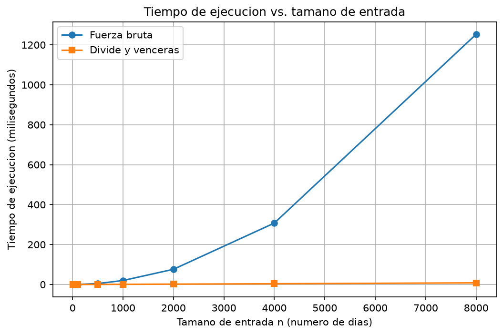

# Laboratorio evaluativo 02 — Dividir y vencer

**David Zuluaga Ceballos**

## Instrucciones para reproducir el experimento

1. Active el entorno virtual desde la raíz del repositorio:
```powershell
   .\venv\Scripts\Activate.ps1
```
2. Instale las dependencias (incluye `matplotlib`):
```powershell
   pip install -r requirements.txt
```
3. Para ejecutar las pruebas de la Parte 1:
```powershell
   Set-Location lab2-divide-y-vencer
   python pruebas.py
```
4. Para ejecutar la medición y generar `graficas/tiempo_vs_n.png` (Parte 2):
```powershell
   python medicion.py
```

Todo se corrió con Python 3.14.3.


## Parte 1 — Implementar y verificar las dos soluciones

Código: [subarreglo.py](subarreglo.py) · [pruebas.py](pruebas.py)

Para hallar la mejor racha de la cooperativa hice dos soluciones. La de fuerza bruta prueba todos los pares de días (i, j) y acumula la suma dentro del ciclo en vez de recalcularla. La de divide y vencerás parte el rango en dos mitades y devuelve el mejor de tres casos: tramo en la mitad izquierda, tramo en la derecha, o tramo que cruza el punto medio. El caso cruzado lo resuelve `suma_cruzada`, que barre desde `medio` hacia la izquierda y desde `medio + 1` hacia la derecha. `subarreglo_maximo` no llama a la fuerza bruta y ninguna función modifica la lista recibida.

Verifiqué con `assert` estos casos:

| Caso | Entrada | Suma esperada |
|---|---|---|
| Serie de ocho días | `[-3, 5, -2, 8, -6, 3, 9, -4]` | 17 (días 2 a 7) |
| Un solo elemento | `[7]` y `[-7]` | 7 y -7 |
| Todos negativos | `[-8, -3, -5, -1, -9]` | -1 |
| Todos positivos | `[2, 4, 1, 3]` | 10 |
| Mejor tramo cruzado | `[-2, 4, 3, -1, 6, -5]` | 12 (índices 1 a 4) |
| Lista sin modificar | la misma serie antes y después | igual |
| Aleatorias | 30 listas (semilla 42, n entre 1 y 60) | ambas coinciden |

En las aleatorias también comprobé que `sum(serie[i:j+1])` sea igual a la suma devuelta, para confirmar que los índices describen el tramo. El código lo revisé con `flake8` (PEP 8), con type hints y docstring Google-style en cada función.


## Parte 2 — Medir y graficar

Código: [medicion.py](medicion.py)

### 2.1 — Predicción (antes de medir)

Para un tamaño de entrada general n (número de días de la serie), al duplicar n a 2n espero:

- **Fuerza bruta, Θ(n²):** el tiempo se multiplica por (2n)² / n² = **4**.
- **Divide y vencerás, Θ(n log n):** el tiempo se multiplica por 2n·log(2n) / (n·log n) = 2·(1 + 1/log₂ n), es decir, **un poco más de 2** (cerca de 2,2 para n entre 500 y 1000, y cerca de 2,17 para n = 4000).
- **Tamaños pequeños:** espero que la fuerza bruta gane con n chico, porque la recursión tiene un costo fijo por llamada. No puedo predecir el n exacto del cruce.

### 2.2 — Cómo medí

Cronometré solo la llamada a cada algoritmo con `time.perf_counter()`, sin incluir la generación de datos. Para cada tamaño generé una lista de enteros entre -100 y 100 con semilla fija (42) y usé **la misma lista** para ambos algoritmos. Cada medición se repitió 5 veces y reporto la **mediana**. En cada tamaño el experimento verifica que ambos algoritmos dan la misma suma.

### 2.3 — Resultados

| Tamaño (n) | Fuerza bruta (ms) | Divide y vencerás (ms) | Bruta / D y V |
| ---------: | ----------------: | ---------------------: | ------------: |
|         10 |            0.0030 |                 0.0052 |          0,58 |
|         50 |            0.0735 |                 0.0523 |          1,41 |
|        100 |            0.1960 |                 0.0968 |          2,02 |
|        500 |            4.6795 |                 0.3876 |         12,07 |
|       1000 |           19.8769 |                 0.8381 |         23,72 |
|       2000 |           76.0926 |                 1.8111 |         42,01 |
|       4000 |          307.5870 |                 3.6990 |         83,15 |
|       8000 |         1252.8426 |                 8.1827 |        153,10 |

Factor de crecimiento del tiempo cuando n se duplica:

| n → 2n | Fuerza bruta (esperado 4) | Divide y vencerás (esperado ≈ 2,2) |
| -----: | ------------------------: | ---------------------------------: |
| 50 → 100 | 2,67 | 1,85 |
| 500 → 1000 | 4,25 | 2,16 |
| 1000 → 2000 | 3,83 | 2,16 |
| 2000 → 4000 | 4,04 | 2,04 |
| 4000 → 8000 | 4,07 | 2,21 |



En la gráfica, con n = 8000 la fuerza bruta llega a unos 1250 ms y divide y vencerás queda cerca de 8 ms, pegada al eje horizontal. La curva de fuerza bruta se curva hacia arriba; la otra casi parece una recta. Por eso incluí la tabla: los tamaños pequeños no se distinguen en la gráfica.


## Parte 3 — Análisis

### 1. Recurrencia

Θ(g(n)) indica cómo crece el número de operaciones básicas (sumas y comparaciones) que hace un algoritmo sobre una lista de n valores, sin contar constantes. T(n) es ese número de operaciones para un rango de n días.

`subarreglo_maximo` parte el rango de n días en dos mitades: 2 subproblemas de tamaño n/2. `suma_cruzada` barre desde el medio hacia ambos lados y entre los dos barridos revisa como máximo n días, así que el caso cruzado cuesta Θ(n). Comparar las tres sumas cuesta Θ(1) y queda absorbido. La recurrencia es:

```text
T(n) = 2T(n/2) + Θ(n)
```

Método maestro: a = 2, b = 2, f(n) = Θ(n). Como n^(log₂2) = n, se cumple f(n) = Θ(n^(log_b a)), que es la condición del caso 2 (con k = 0). Por tanto T(n) = Θ(n log n).

La fuerza bruta tiene un ciclo que elige el inicio i y otro que elige el fin j ≥ i; con la suma acumulada, cada paso cuesta Θ(1). Se revisan n(n+1)/2 pares, que es Θ(n²).

### 2. Lo medido contra lo esperado

En la gráfica la fuerza bruta se dispara al crecer n, y divide y vencerás crece mucho más despacio. Tomé 4000 → 8000, donde n se duplica:

```text
fuerza bruta:       1252.8426 / 307.5870 ≈ 4,07   (predicción: 4)
divide y vencerás:     8.1827 /   3.6990 ≈ 2,21   (predicción: 2,17)
```

Ambos coinciden con lo que predicen Θ(n²) y Θ(n log n). Con 500 → 1000 pasa lo mismo (4,25 y 2,16).

Hay un resultado raro con tamaños pequeños: de 50 a 100 la fuerza bruta solo se multiplicó por 2,67 y divide y vencerás por 1,85, ambos por debajo de lo esperado. Con tiempos de unas décimas de milisegundo, los costos fijos (llamar funciones, preparar los ciclos, la resolución del cronómetro) pesan más que el crecimiento con n. Por eso la forma asintótica solo aparece desde n ≈ 500.

### 3. Tamaños pequeños

Con n = 10 la fuerza bruta es más rápida (0,0030 ms contra 0,0052 ms). Con n = 50 divide y vencerás ya gana (0,0523 ms contra 0,0735 ms). El cruce está entre 10 y 50; no lo ubiqué con más precisión porque no medí tamaños intermedios. La causa es que divide y vencerás hace unas 2n − 1 llamadas recursivas, y en Python cada llamada tiene un costo fijo que la fuerza bruta (dos ciclos simples) no paga. Con n = 100 la ventaja ya es de 2 veces y con n = 8000 es de unas 153 veces.

### 4. ¿Cuándo conviene dividir?

Para hallar el máximo de un arreglo de n números, dividirlo y comparar los dos máximos cuesta Θ(1) al combinar:

```text
T(n) = 2T(n/2) + Θ(1)
```

Aquí a = 2, b = 2 y f(n) = Θ(1) crece menos que n^(log₂2) = n, así que aplica el caso 1 y T(n) = Θ(n). Con un arreglo de n = 1000 números, recorrerlo una vez hace 999 comparaciones; dividirlo hace también 999 comparaciones, más unas 1999 llamadas recursivas. No mejora, y no podía mejorar: cualquier algoritmo necesita al menos n − 1 comparaciones para el máximo. Dividir conviene cuando mejora el orden de crecimiento a un costo de combinar razonable: en el subarreglo máximo se pasa de Θ(n²) a Θ(n log n) pagando Θ(n) por combinar.

### 5. Concepto para la gerente

Recomiendo divide y vencerás. Estimo una serie de 1.000.000 de registros (un solo sensor) partiendo de mi medición más grande, n = 8000, y escalando con la forma de cada curva:

```text
Fuerza bruta: n × 125  →  tiempo × 125² = 15 625
1252.84 ms × 15 625 ≈ 19 575 s ≈ 5,4 horas

Divide y vencerás: factor = (10⁶·log₂10⁶) / (8000·log₂8000) ≈ 192
8.18 ms × 192 ≈ 1572 ms ≈ 1,6 s
```

Una regla de tres lineal daría 1252.84 ms × 125 ≈ 157 s (2,6 minutos) para la fuerza bruta, y subestimaría el tiempo real unas 125 veces. La cooperativa no declaró un plazo, así que uso como límite el tope de dos minutos (120 s) del enunciado: con 1.000.000 de registros la fuerza bruta lo incumpliría unas 160 veces. Para el trabajo actual, 1.500 tiendas de 2.000 días, estimo con n = 2000: fuerza bruta 76.09 ms × 1500 ≈ 114 s (casi en el límite) y divide y vencerás 1.81 ms × 1500 ≈ 2,7 s.

Todos estos valores son estimaciones: suponen que las constantes medidas se mantienen y no consideran memoria ni caché con listas tan grandes.
